Merkle Tree概念
=============

 

 Merkle Tree，通常也被称作Hash Tree，顾名思义，就是存储hash值的一棵树。Merkle树的叶子是数据块(例如，文件或者文件的集合)的hash值。非叶节点是其对应子节点串联字符串的hash。[1]

 1\. Hash

 Hash是一个把任意长度的数据映射成固定长度数据的函数[2]。例如，对于数据完整性校验，最简单的方法是对整个数据做Hash运算得到固定长度的Hash值，然后把得到的Hash值公布在网上，这样用户下载到数据之后，对数据再次进行Hash运算，比较运算结果和网上公布的Hash值进行比较，如果两个Hash值相等，说明下载的数据没有损坏。可以这样做是因为输入数据的稍微改变就会引起Hash运算结果的面目全非，而且根据Hash值反推原始输入数据的特征是困难的。[3]

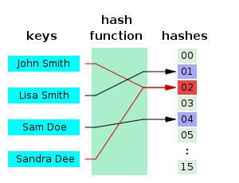

 如果从一个稳定的服务器进行下载，采用单一Hash是可取的。但如果数据源不稳定，一旦数据损坏，就需要重新下载，这种下载的效率是很低的。

 2\. Hash List

 在点对点网络中作数据传输的时候，会同时从多个机器上下载数据，而且很多机器可以认为是不稳定或者不可信的。为了校验数据的完整性，更好的办法是把大的文件分割成小的数据块（例如，把分割成2K为单位的数据块）。这样的好处是，如果小块数据在传输过程中损坏了，那么只要重新下载这一快数据就行了，不用重新下载整个文件。

 怎么确定小的数据块没有损坏哪？只需要为每个数据块做Hash。BT下载的时候，在下载到真正数据之前，我们会先下载一个Hash列表。那么问题又来了，怎么确定这个Hash列表本事是正确的哪？答案是把每个小块数据的Hash值拼到一起，然后对这个长字符串在作一次Hash运算，这样就得到Hash列表的根Hash(Top Hash or Root Hash)。下载数据的时候，首先从可信的数据源得到正确的根Hash，就可以用它来校验Hash列表了，然后通过校验后的Hash列表校验数据块。

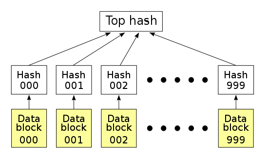

 3\. Merkle Tree

 Merkle Tree可以看做Hash List的泛化（Hash List可以看作一种特殊的Merkle Tree，即树高为2的多叉Merkle Tree）。

 在最底层，和哈希列表一样，我们把数据分成小的数据块，有相应地哈希和它对应。但是往上走，并不是直接去运算根哈希，而是把相邻的两个哈希合并成一个字符串，然后运算这个字符串的哈希，这样每两个哈希就结婚生子，得到了一个”子哈希“。如果最底层的哈希总数是单数，那到最后必然出现一个单身哈希，这种情况就直接对它进行哈希运算，所以也能得到它的子哈希。于是往上推，依然是一样的方式，可以得到数目更少的新一级哈希，最终必然形成一棵倒挂的树，到了树根的这个位置，这一代就剩下一个根哈希了，我们把它叫做 Merkle Root[3]。

 在p2p网络下载网络之前，先从可信的源获得文件的Merkle Tree树根。一旦获得了树根，就可以从其他从不可信的源获取Merkle tree。通过可信的树根来检查接受到的Merkle Tree。如果Merkle Tree是损坏的或者虚假的，就从其他源获得另一个Merkle Tree，直到获得一个与可信树根匹配的Merkle Tree。

 Merkle Tree和Hash List的主要区别是，可以直接下载并立即验证Merkle Tree的一个分支。因为可以将文件切分成小的数据块，这样如果有一块数据损坏，仅仅重新下载这个数据块就行了。如果文件非常大，那么Merkle tree和Hash list都很到，但是Merkle tree可以一次下载一个分支，然后立即验证这个分支，如果分支验证通过，就可以下载数据了。而Hash list只有下载整个hash list才能验证。

Merkle Tree的特点
==============

1. MT是一种树，大多数是二叉树，也可以多叉树，无论是几叉树，它都具有树结构的所有特点；
2. Merkle Tree的叶子节点的value是数据集合的单元数据或者单元数据HASH。
3. 非叶子节点的value是根据它下面所有的叶子节点值，然后按照Hash算法计算而得出的。[4][5]

 通常，加密的hash方法像SHA-2和MD5用来做hash。但如果仅仅防止数据不是蓄意的损坏或篡改，可以改用一些安全性低但效率高的校验和算法，如CRC。

 Second Preimage Attack: Merkle tree的树根并不表示树的深度，这可能会导致second-preimage attack，即攻击者创建一个具有相同Merkle树根的虚假文档。一个简单的解决方法在Certificate Transparency中定义：当计算叶节点的hash时，在hash数据前加0x00。当计算内部节点是，在前面加0x01。另外一些实现限制hash tree的根，通过在hash值前面加深度前缀。因此，前缀每一步会减少，只有当到达叶子时前缀依然为正，提取的hash链才被定义为有效。

Merkle Tree的操作
==============

 1\. 创建Merkle Tree

 加入最底层有9个数据块。

 step1：（红色线）对数据块做hash运算，Node0i = hash(Data0i), i=1,2,…,9

 step2: （橙色线）相邻两个hash块串联，然后做hash运算，Node1((i+1)/2) = hash(Node0i+Node0(i+1)), i=1,3,5,7;对于i=9, Node1((i+1)/2) = hash(Node0i)

 step3: （黄色线）重复step2

 step4：（绿色线）重复step2

 step5：（蓝色线）重复step2，生成Merkle Tree Root

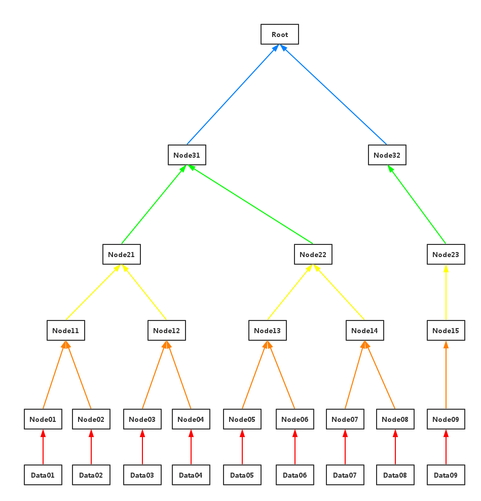

易得，创建Merkle Tree是O(n)复杂度(这里指O(n)次hash运算)，n是数据块的大小。得到Merkle Tree的树高是log(n)+1。

 2\. 检索数据块

为了更好理解，我们假设有A和B两台机器，A需要与B相同目录下有8个文件，文件分别是f1 f2 f3 ....f8。这个时候我们就可以通过Merkle Tree来进行快速比较。假设我们在文件创建的时候每个机器都构建了一个Merkle Tree。具体如下图:

 从上图可得知，叶子节点node7的value = hash(f1),是f1文件的HASH;而其父亲节点node3的value = hash(v7, v8)，也就是其子节点node7 node8的值得HASH。就是这样表示一个层级运算关系。root节点的value其实是所有叶子节点的value的唯一特征。

 假如A上的文件5与B上的不一样。我们怎么通过两个机器的merkle treee信息找到不相同的文件? 这个比较检索过程如下:

 Step1\. 首先比较v0是否相同,如果不同，检索其孩子node1和node2.

 Step2\. v1 相同，v2不同。检索node2的孩子node5 node6;

 Step3\. v5不同，v6相同，检索比较node5的孩子node 11 和node 12

 Step4\. v11不同，v12相同。node 11为叶子节点，获取其目录信息。

 Step5\. 检索比较完毕。

 以上过程的理论复杂度是Log(N)。过程描述图如下:

 

 从上图可以得知真个过程可以很快的找到对应的不相同的文件。

 3\. 更新，插入和删除

 虽然网上有很多关于Merkle Tree的资料，但大部分没有涉及Merkle Tree的更新、插入和删除操作，讨论Merkle Tree的检索和遍历的比较多。我也是非常困惑，一种树结构的操作肯定不仅包括查找，也包括更新、插入和删除的啊。后来查到stackexchange上的一个问题，才稍微有点明白，原文见[6]。

 对于Merkle Tree数据块的更新操作其实是很简单的，更新完数据块，然后接着更新其到树根路径上的Hash值就可以了，这样不会改变Merkle Tree的结构。但是，插入和删除操作肯定会改变Merkle Tree的结构，如下图，一种插入操作是这样的：

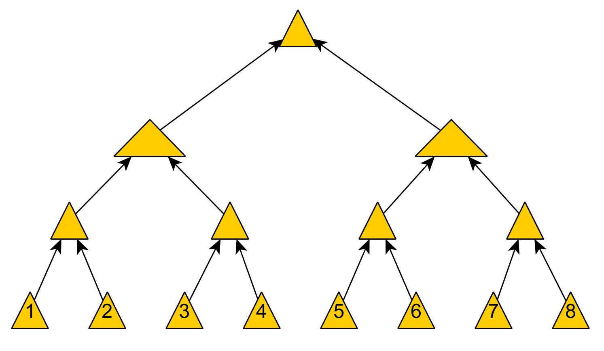

 插入数据块0后(考虑数据块的位置)，Merkle Tree的结构是这样的：

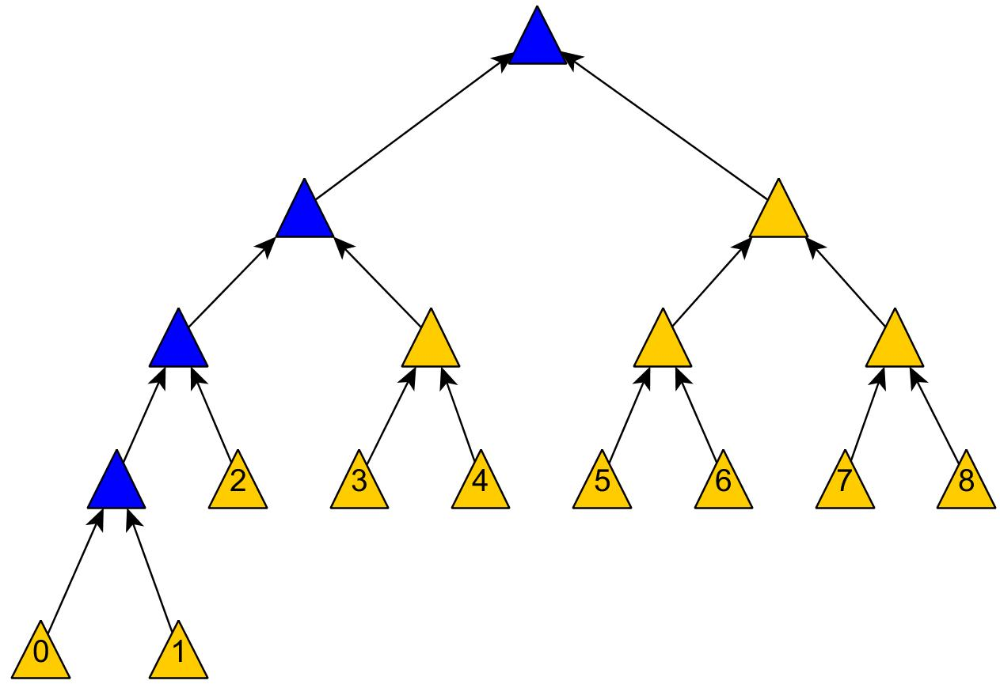

 而[6]中的同学在考虑一种插入的算法，满足下面条件：

* re-hashing操作的次数控制在log(n)以内
* 数据块的校验在log(n)+1以内
* 除非原始树的n是偶数，插入数据后的树没有孤儿，并且如果有孤儿，那么孤儿是最后一个数据块
* 数据块的顺序保持一致
* 插入后的Merkle Tree保持平衡

 然后上面的插入结果就会变成这样：

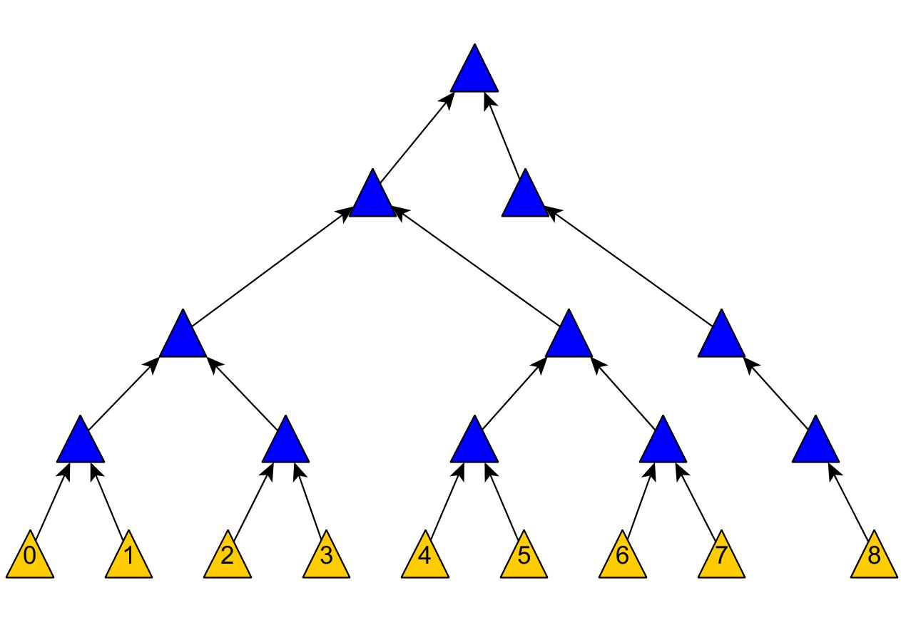

 根据[6]中回答者所说，Merkle Tree的插入和删除操作其实是一个工程上的问题，不同问题会有不同的插入方法。如果要确保树是平衡的或者是树高是log(n)的，可以用任何的标准的平衡二叉树的模式，如AVL树，红黑树，伸展树，2-3树等。这些平衡二叉树的更新模式可以在O(lgn)时间内完成插入操作，并且能保证树高是O(lgn)的。那么很容易可以看出更新所有的Merkle Hash可以在O((lgn)2)时间内完成（对于每个节点如要更新从它到树根O(lgn)个节点，而为了满足树高的要求需要更新O(lgn)个节点）。如果仔细分析的话，更新所有的hash实际上可以在O(lgn)时间内完成，因为要改变的所有节点都是相关联的，即他们要不是都在从某个叶节点到树根的一条路径上，或者这种情况相近。

 [6]的回答者说实际上Merkle Tree的结构(是否平衡，树高限制多少)在大多数应用中并不重要，而且保持数据块的顺序也在大多数应用中也不需要。因此，可以根据具体应用的情况，设计自己的插入和删除操作。一个通用的Merkle Tree插入删除操作是没有意义的。

Merkle Tree的应用
==============

 1\. 数字签名

 最初Merkle Tree目的是高效的处理Lamport one-time signatures。 每一个Lamport key只能被用来签名一个消息，但是与Merkle tree结合可以来签名多条Merkle。这种方法成为了一种高效的数字签名框架，即Merkle Signature Scheme。

 2\. P2P网络

 在P2P网络中，Merkle Tree用来确保从其他节点接受的数据块没有损坏且没有被替换，甚至检查其他节点不会欺骗或者发布虚假的块。大家所熟悉的BT下载就是采用了P2P技术来让客户端之间进行数据传输，一来可以加快数据下载速度，二来减轻下载服务器的负担。BT即BitTorrent，是一种中心索引式的P2P文件分分析通信协议[7]。

 要进下载必须从中心索引服务器获取一个扩展名为torrent的索引文件（即大家所说的种子），torrent文件包含了要共享文件的信息，包括文件名，大小，文件的Hash信息和一个指向Tracker的URL[8]。Torrent文件中的Hash信息是每一块要下载的文件内容的加密摘要，这些摘要也可运行在下载的时候进行验证。大的torrent文件是Web服务器的瓶颈，而且也不能直接被包含在RSS或gossiped around(用流言传播协议进行传播)。一个相关的问题是大数据块的使用，因为为了保持torrent文件的非常小，那么数据块Hash的数量也得很小，这就意味着每个数据块相对较大。大数据块影响节点之间进行交易的效率，因为只有当大数据块全部下载下来并校验通过后，才能与其他节点进行交易。

 就解决上面两个问题是用一个简单的Merkle Tree代替Hash List。设计一个层数足够多的满二叉树，叶节点是数据块的Hash，不足的叶节点用0来代替。上层的节点是其对应孩子节点串联的hash。Hash算法和普通torrent一样采用SHA1。其数据传输过程和第一节中描述的类似。

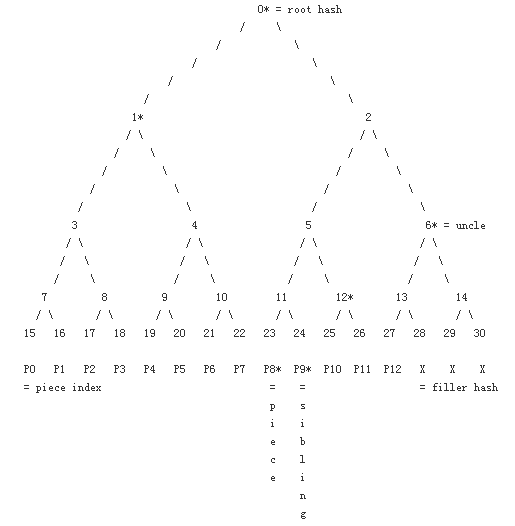

 3\. Trusted Computing

 可信计算是可信计算组为分布式计算环境中参与节点的计算平台提供端点可信性而提出的。可信计算技术在计算平台的硬件层引入可信平台模块(Trusted Platform，TPM)，实际上为计算平台提供了基于硬件的可信根(Root of trust，RoT)。从可信根出发，使用信任链传递机制，可信计算技术可对本地平台的硬件及软件实施逐层的完整性度量，并将度量结果可靠地保存再TPM的平台配置寄存器(Platform configuration register，PCR)中，此后远程计算平台可通过远程验证机制(Remote Attestation)比对本地PCR中度量结果，从而验证本地计算平台的可信性。可信计算技术让分布式应用的参与节点摆脱了对中心服务器的依赖，而直接通过用户机器上的TPM芯片来建立信任，使得创建扩展性更好、可靠性更高、可用性更强的安全分布式应用成为可能[10]。可信计算技术的核心机制是远程验证(remote attestation),分布式应用的参与结点正是通过远程验证机制来建立互信,从而保障应用的安全。

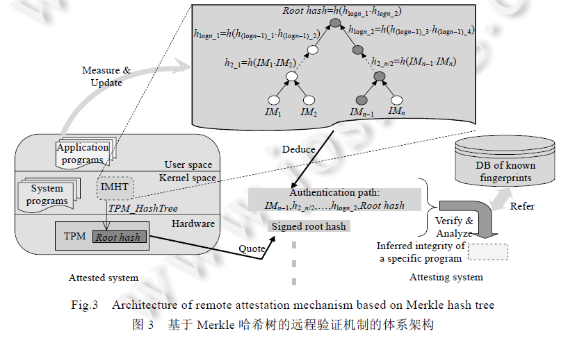

 文献[10]提出了一种基于Merkle Tree的远程验证机制，其核心是完整性度量值哈希树。

 首先,RAMT 在内核中维护的不再是一张完整性度量值列表(ML),而是一棵完整性度量值哈希树(integrity measurement hash tree,简称IMHT).其中,IMHT的叶子结点存储的数据对象是待验证计算平台上被度量的各种程序的完整性哈希值,而其内部结点则依据Merkle 哈希树的构建规则由子结点的连接的哈希值动态生成。

 其次,为了维护IMHT 叶子结点的完整性,RAMT 需要使用TPM 中的一段存储器来保存IMHT 可信根哈希的值。

 再次,RAMT 的完整性验证过程基于认证路径(authentication path)实施.认证路径是指IMHT 上从待验证叶子结点到根哈希的路径。

 4\. IPFS

 IPFS(InterPlanetary File System)是很多NB的互联网技术的综合体，如DHT( Distributed HashTable，分布式哈希表)，Git版本控制系统，Bittorrent等。它创建了一个P2P的集群，这个集群允许IPFS对象的交换。全部的IPFS对象形成了一个被称作Merkle DAG的加密认证数据结构。

 IPFS对象是一个含有两个域的数据结构:

* Data – 非结构的二进制数据，大小小于256kB
* Links – 一个Link数据结构的数组。IPFS对象通过他们链接到其他对象

 Link数据结构包含三个域：

* Name – Link的名字
* Hash – Link链接到对象的Hash
* Size – Link链接到对象的累积大小，包括它的Links

 通过Name和Links，IPFS的集合组成了一个Merkle DAG（有向无环图）。

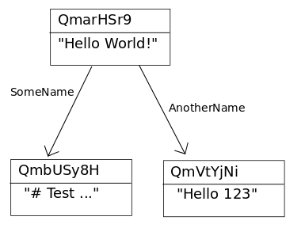

 对于小文件（\<256kB），是一个没有Links的IPFS对象。

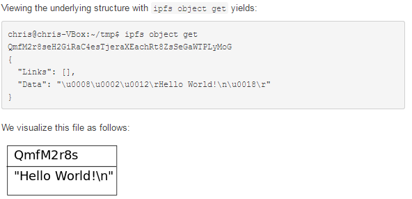

 对于大文件，被表示为一个文件块(\<256kB)的集合。只有拥有最小的Data的对象来代表这个大文件。这个对象的Links的名字都为空字符串。

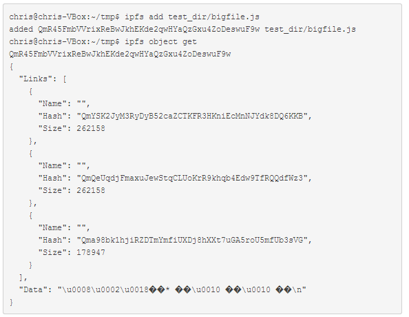

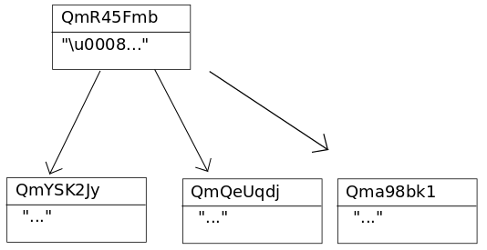

 目录结构：目录是没有数据的IPFS对象，它的链接指向其包含的文件和目录。

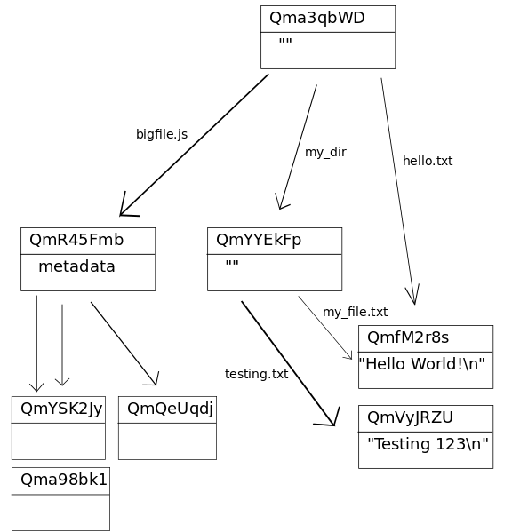

 IPFS可以表示Git使用的数据结构，Git commit object。Commit Object主要的特点是他有一个或多个名为’parent0’和‘parent1’等的链接（这些链接指向前一个版本），以及一个名为object的对象(在Git中成为tree)指向引用这个commit的文件系统结构。

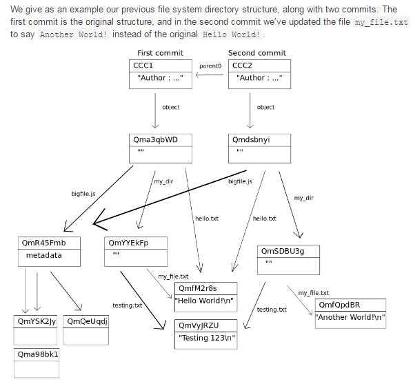

 5\. BitCoin和Ethereum[12][13]

 Merkle Proof最早的应用是Bitcoin，它是由中本聪在2009年描述并创建的。Bitcoin的Blockchain利用Merkle proofs来存储每个区块的交易。

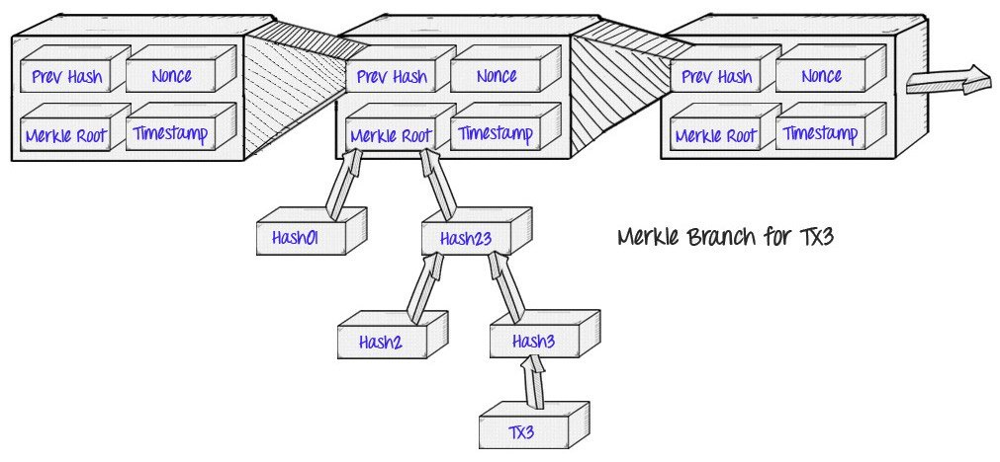

 而这样做的好处，也就是中本聪描述到的“简化支付验证”（Simplified Payment Verification，SPV）的概念:一个“轻客户端”（light client）可以仅下载链的区块头即每个区块中的80byte的数据块，仅包含五个元素，而不是下载每一笔交易以及每一个区块：

* 上一区块头的哈希值
* 时间戳
* 挖矿难度值
* 工作量证明随机数（nonce）
* 包含该区块交易的Merkle Tree的根哈希

 如果客户端想要确认一个交易的状态，它只需简单的发起一个Merkle proof请求，这个请求显示出这个特定的交易在Merkle trees的一个之中，而且这个Merkle Tree的树根在主链的一个区块头中。

 但是Bitcoin的轻客户端有它的局限。一个局限是，尽管它可以证明包含的交易，但是它不能进行涉及当前状态的证明（如数字资产的持有，名称注册，金融合约的状态等）。

 Bitcoin如何查询你当前有多少币？一个比特币轻客户端，可以使用一种协议，它涉及查询多个节点，并相信其中至少会有一个节点会通知你，关于你的地址中任何特定的交易支出，而这可以让你实现更多的应用。但对于其他更为复杂的应用而言，这些远远是不够的。一笔交易影响的确切性质（precise nature），可以取决于此前的几笔交易，而这些交易本身则依赖于更为前面的交易，所以最终你可以验证整个链上的每一笔交易。为了解决这个问题，Ethereum的Merkle Tree的概念，会更进一步。

 **Ethereum的Merkle Proof**

 每个以太坊区块头不是包括一个Merkle树，而是为三种对象设计的三棵树：

* 交易Transaction
* 收据Receipts(本质上是显示每个交易影响的多块数据)
* 状态State

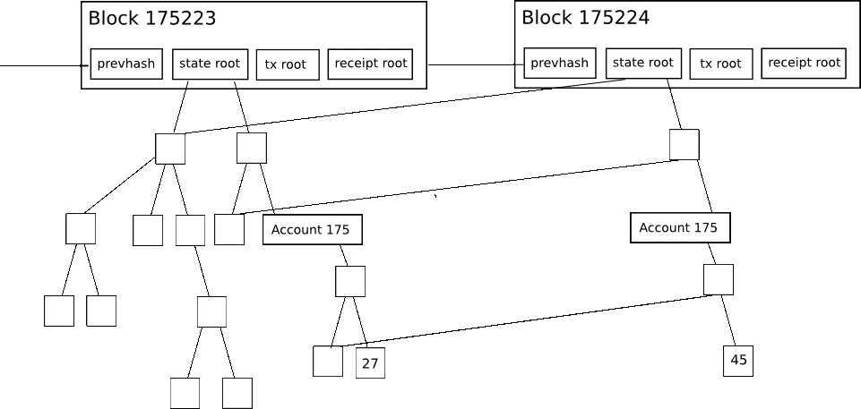

 这使得一个非常先进的轻客户端协议成为了可能，它允许轻客户端轻松地进行并核实以下类型的查询答案：

* 这笔交易被包含在特定的区块中了么？
* 告诉我这个地址在过去30天中，发出X类型事件的所有实例（例如，一个众筹合约完成了它的目标）
* 目前我的账户余额是多少？
* 这个账户是否存在？
* 假如在这个合约中运行这笔交易，它的输出会是什么？

 第一种是由交易树（transaction tree）来处理的；第三和第四种则是由状态树（state tree）负责处理，第二种则由收据树（receipt tree）处理。计算前四个查询任务是相当简单的。服务器简单地找到对象，获取Merkle分支，并通过分支来回复轻客户端。

 第五种查询任务同样也是由状态树处理，但它的计算方式会比较复杂。这里，我们需要构建一个Merkle状态转变证明（Merkle state transition proof）。从本质上来讲，这样的证明也就是在说“如果你在根S的状态树上运行交易T，其结果状态树将是根为S'，log为L，输出为O” （“输出”作为存在于以太坊的一种概念，因为每一笔交易都是一个函数调用；它在理论上并不是必要的）。

 为了推断这个证明，服务器在本地创建了一个假的区块，将状态设为 S，并在请求这笔交易时假装是一个轻客户端。也就是说，如果请求这笔交易的过程，需要客户端确定一个账户的余额，这个轻客户端(由服务器模拟的)会发出一个余额查询请求。如果需要轻客户端在特点某个合约的存储中查询特定的条目，这个轻客户端就会发出这样的请求。也就是说服务器(通过模拟一个轻客户端)正确回应所有自己的请求，但服务器也会跟踪它所有发回的数据。

 然后，服务器从上述的这些请求中把数据合并并把数据以一个证明的方式发送给客户端。

 然后，客户端会进行相同的步骤，但会将服务器提供的证明作为一个数据库来使用。如果客户端进行步骤的结果和服务器提供的是一样的话，客户端就接受这个证明。

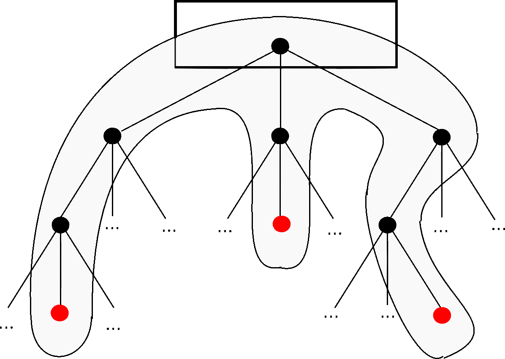

 **MPT(Merkle Patricia Trees)**

 前面我们提到，最为简单的一种Merkle Tree大多数情况下都是一棵二叉树。然而，Ethereum所使用的Merkle Tree则更为复杂，我们称之为“梅克尔.帕特里夏树”（Merkle Patricia tree）。

 对于验证属于list格式（本质上来讲，它就是一系列前后相连的数据块）的信息而言，二叉Merkle Tree是非常好的数据结构。对于交易树来说，它们也同样是不错的，因为一旦树已经建立，花多少时间来编辑这棵树并不重要，树一旦建立了，它就会永远存在并且不会改变。

 但是，对于状态树，情况会更复杂些。以太坊中的状态树基本上包含了一个键值映射，其中的键是地址，而值包括账户的声明、余额、随机数nounce、代码以及每一个账户的存储（其中存储本身就是一颗树）。例如，摩登测试网络（the Morden testnet ）的创始状态如下所示：

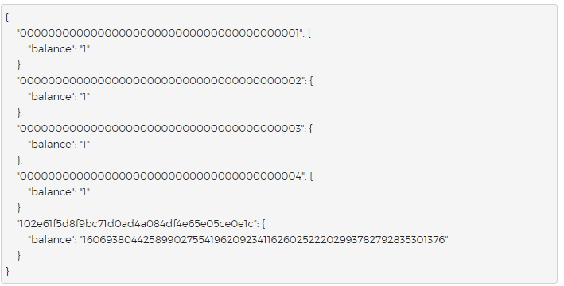

 然而，不同于交易历史记录，状态树需要经常地进行更新：账户余额和账户的随机数nonce经常会更变，更重要的是，新的账户会频繁地插入，存储的键（ key）也会经常被插入以及删除。我们需要这样的数据结构，它能在一次插入、更新、删除操作后快速计算到树根，而不需要重新计算整个树的Hash。这种数据结构同样得包括两个非常好的第二特征：

* 树的深度是有限制的，即使考虑攻击者会故意地制造一些交易，使得这颗树尽可能地深。不然，攻击者可以通过操纵树的深度，执行拒绝服务攻击（DOS attack），使得更新变得极其缓慢。
* 树的根只取决于数据，和其中的更新顺序无关。换个顺序进行更新，甚至重新从头计算树，并不会改变根。

 MPT是最接近同时满足上面的性质的的数据结构。MPT的工作原理的最简单的解释是，值通过键来存储，键被编码到搜索树必须要经过的路径中。每个节点有16个孩子，因此路径又16进制的编码决定：例如，键‘dog’的16进制编码是6 4 6 15 6 7，所以从root开始到第六个分支，然后到第四个，再到第六个，再到第十五个，这样依次进行到达树的叶子。

 在实践中，当树稀少时也会有一些额外的优化，我们会使过程更为有效，但这是基本的原则。

 6\. 其他应用

 用到Merkle Tree的应用还有很多，比如Git，Amazon Dynamo，Apache Wave Protocol，Tahoe-LAFS backup system，Certificate Transparency framework，NoSQL systems like Apache Cassadra and Riak等

转载自:<http://www.cnblogs.com/fengzhiwu/p/5524324.html>